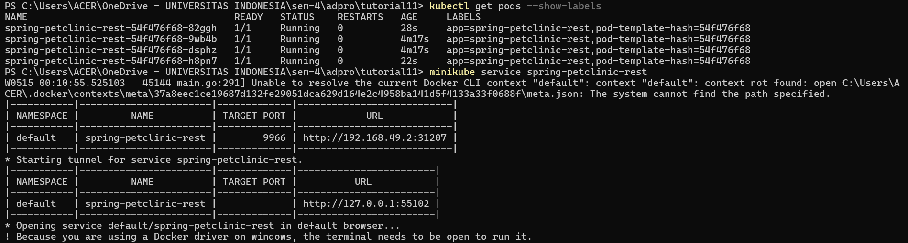

# advprog-module11-deployment
Module 11 Advanced Programming 2023/2024

## Hello Minikube
1. Run before and after expose service
#### Before

#### After

Before expose of the service, it doesnt show any logs whenever there are any open browser. After the exposal of the service, it began to accept request. Those requests can be seen in the logs as shown in the picture above.

2. The -n stands for namespace. So, by declaring -n, we instruct the terminal to search for the service with the namespace that we want.

## Rolling Update & Kubernetes
1. The difference is the downtime of Recreate strategy. As the name suggests, recreate is a strategy where if there is an update, the previous deployment will be deleted first, then it will create a new updated version of the deployments. Therefore, Recreate strategy gives a longer time in updating a deployment compared to rolling update strategy.
2. Here are the screenshot

In the above screenshot, i try to make deployment and try to delete it to show the recreate method. It can be seen that after deleting, there are new pods made.

In the above screenshot, I try to run and see the deployment through the service as instructed in the tutorial.

3. The manifest files for Recreate strategy is named deploymentRecreate.yaml. It is the same as in the tutorial, but now the strategy type used is Recreate. (See deploymentRecreate.yaml)

4. In my opinion, kubernetes manifest files help me a lot especially when I want to create a deployment. With kubernetes manifest files, I don't have to remember the sequence of the code, the syntax, the flow, etc. I simply run 1 line `kubectl apply -f <yaml files>` which will make either deployment, services, or any other things according to the yaml files configuration. It gives efficiency to the maximum level considering we humans have a tendency to forget complex things that are difficult to remember.